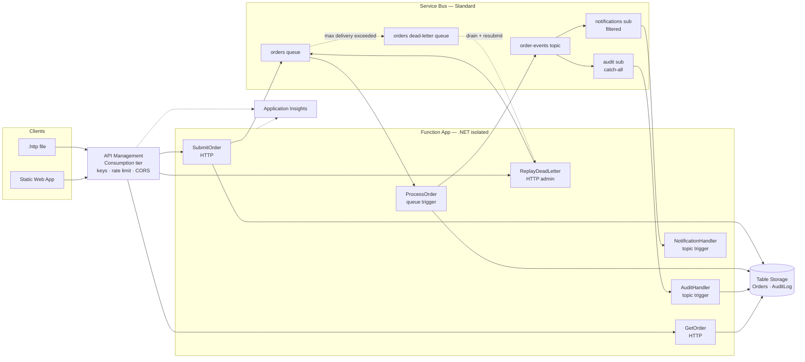

# Azure Integration Services Demo — MVP Specification

**Status:** Draft for review
**Last updated:** 2026-08-20
**Owner:** [@mikevh](https://github.com/mikevh)

---

## 1. Purpose

A self-contained, deployable demonstration of four Azure integration services working
together as one system:

| Service | What it proves in this demo |
|---|---|
| **API Management (APIM)** | Gateway-level policy: subscription keys, rate limiting, CORS, request shaping, correlation-ID injection |
| **Service Bus** | Async decoupling (queue), pub/sub fan-out with filtering (topic + subscriptions), retries, dead-lettering, replay |
| **Azure Functions** | Event-driven compute — HTTP producers and Service Bus consumers, scale-out under burst |
| **Application Insights** | One correlation ID stitched across gateway → queue → function → topic → subscribers, visible as a single end-to-end transaction |

All infrastructure is defined in **Terraform**. The whole environment must be creatable
and destroyable on demand so it can live at near-zero cost between demos.

### 1.1 Success criteria

The demo succeeds if a presenter can, in under ten minutes:

1. Submit an order and watch it flow through the gateway, queue, and processor.
2. Show two topic subscribers receiving the same event, one of them filtered out.
3. Deliberately poison a message, watch it retry, land in the dead-letter queue, then replay it.
4. Trip the rate limit and get a `429` from the gateway, never touching compute.
5. Open Application Insights and follow one order end to end as a single transaction on the Application Map.

---

## 2. Out of scope

Explicitly **not** in the MVP. Each is a deliberate cut, not an oversight:

- CI/CD pipelines (no GitHub Actions, no automated deploy)
- Automated tests (no unit or integration test suite)
- VNet integration, private endpoints, self-hosted gateway — unavailable in APIM Consumption anyway
- The APIM developer portal — unavailable in APIM Consumption
- Entra ID / OAuth caller authentication (subscription keys only)
- Multiple environments (single `demo` environment; no prod parameterization)
- Custom domains and TLS certificates
- Cosmos DB, Azure SQL, or any relational store
- Service Bus sessions, duplicate detection, geo-DR
- Terraform remote state (local state only)

---

## 3. Architecture



### 3.1 Request path

`POST /orders` is accepted synchronously and processed asynchronously:

1. APIM validates the subscription key, applies the rate limit, and generates an `x-correlation-id`, overriding whatever the caller sent.
2. `SubmitOrder` writes an `Accepted` row to Table Storage, enqueues the order to `orders`, and returns `202 Accepted` with a `Location` header.
3. `ProcessOrder` picks the message up, simulates work, updates the row to `Completed` or `Rejected`, and publishes an event to `order-events`.
4. `NotificationHandler` and `AuditHandler` receive that event independently, subject to their subscription filters.
5. The caller polls `GET /orders/{orderId}` for final status.

**Ingress decision:** APIM routes to an HTTP-triggered Function that enqueues via the SDK,
rather than APIM writing to Service Bus directly from policy. This puts compute in the
request path but keeps validation, correlation, and enqueue logic in debuggable C# rather
than policy XML.

---

## 4. Azure resource inventory

Region: **West US 2**. All resources in a single resource group, destroyable in one command.

Names use a `random_string` suffix (5 lowercase alphanumeric) for globally-unique resources.

| Resource | Name pattern | SKU / tier | Notes |
|---|---|---|---|
| Resource group | `rg-aisdemo-wus2` | — | Single container for everything |
| API Management | `apim-aisdemo-<suffix>` | `Consumption_0` | Per-call billing, 1M free calls/mo |
| Service Bus namespace | `sb-aisdemo-<suffix>` | `Standard` | Standard is the minimum tier supporting topics |
| Service Bus queue | `orders` | — | `max_delivery_count = 5`, `lock_duration = PT1M`, DLQ enabled |
| Service Bus topic | `order-events` | — | |
| SB subscription | `notifications` | — | SQL filter, see §6.3 |
| SB subscription | `audit` | — | Catch-all (`1=1`) |
| Storage account | `staisdemo<suffix>` | `Standard_LRS` | Backs the Function App runtime **and** the two demo tables |
| Storage table | `Orders` | — | Order state |
| Storage table | `AuditLog` | — | Audit trail written by `AuditHandler` |
| Storage container | `deployments` | — | Flex Consumption deployment packages; required by `storage_container_endpoint` |
| Service plan | `asp-aisdemo-<suffix>` | `FC1` | Linux; required by the Function App's `service_plan_id` |
| Function App | `func-aisdemo-<suffix>` | Flex Consumption | Linux, `dotnet-isolated` 10, system-assigned identity |
| Log Analytics workspace | `log-aisdemo-<suffix>` | `PerGB2018` | 30-day retention |
| Application Insights | `appi-aisdemo-<suffix>` | Workspace-based | Wired to APIM **and** the Function App |
| Diagnostic setting | `metrics-to-log-analytics` | — | Routes Service Bus `AllMetrics` to the workspace so DLQ depth is queryable in KQL (§10) |
| Static Web App | `swa-aisdemo-<suffix>` | `Free` | Hosts the demo UI |

Standard tags on every resource: `project = aisdemo`, `environment = demo`,
`managedBy = terraform`, `owner = <var>`.

---

## 5. API surface (APIM)

API name `orders-api`, path `orders-demo`, HTTPS only.
Product `aisdemo-starter`, published, **subscription required**.

| Method | Path | Backend function | Success |
|---|---|---|---|
| `POST` | `/orders` | `SubmitOrder` | `202 Accepted` |
| `GET` | `/orders/{orderId}` | `GetOrder` | `200 OK` / `404` |
| `POST` | `/admin/replay` | `ReplayDeadLetter` | `200 OK` |

### 5.1 Policies

Applied at API scope unless noted:

- **CORS** — allow the Static Web App origin plus `http://localhost:*`; methods `GET, POST, OPTIONS`; headers `content-type, ocp-apim-subscription-key, x-correlation-id`.
- **Correlation** — generate a GUID and set `x-correlation-id` with `exists-action="override"`. A caller-supplied value is discarded at the gateway and never reaches the backend or the telemetry pipeline. Forward it to the backend and echo it on the response.
- **Rate limit** (operation scope, `POST /orders` only) — `rate-limit-by-key`, 10 calls per 60 seconds, keyed on `context.Subscription.Id`.
- **Backend auth** — `set-backend-service` to the Function App, with the host key supplied from a secret named value (see §9.3).
- **Error shaping** — `on-error` returns `application/problem+json` carrying the correlation ID.

> The plain `rate-limit` and `quota` policies are **not available in the Consumption tier**.
> `rate-limit-by-key` with an explicit key expression is the required substitute.

**Why the correlation ID is never caller-supplied.** An inbound header is untrusted input
that would flow straight into the logging pipeline as a telemetry dimension — opening up
log injection via control characters, unbounded values in every custom dimension, and
deliberate ID collision that makes traces ambiguous. The gateway owns the identity
instead. Cross-boundary trace joining is not lost: W3C `traceparent` handles it, and APIM
and the Service Bus SDK propagate it without help (§6.1).

### 5.2 Contracts

**`POST /orders` request**

```json
{
  "customerId": "CUST-1042",
  "customerName": "Contoso Ltd",
  "items": [
    { "sku": "WIDGET-01", "quantity": 3, "unitPrice": 249.99 }
  ],
  "simulateFailure": false
}
```

**`POST /orders` → `202 Accepted`**

```json
{
  "orderId": "0f2c8a1e-...",
  "status": "Accepted",
  "correlationId": "b71d...",
  "statusUrl": "/orders/0f2c8a1e-..."
}
```

**`GET /orders/{orderId}` → `200 OK`**

```json
{
  "orderId": "0f2c8a1e-...",
  "status": "Completed",
  "customerId": "CUST-1042",
  "customerName": "Contoso Ltd",
  "orderTotal": 749.97,
  "itemCount": 3,
  "submittedAt": "2026-08-20T17:04:11Z",
  "processedAt": "2026-08-20T17:04:13Z",
  "attemptCount": 1,
  "failureReason": null,
  "correlationId": "b71d..."
}
```

**`POST /admin/replay?max=10` → `200 OK`**

```json
{ "drained": 3, "resubmitted": 3, "orderIds": ["...", "...", "..."] }
```

### 5.3 Order status model

| Status | Set by | Meaning |
|---|---|---|
| `Accepted` | `SubmitOrder` | Persisted and enqueued |
| `Processing` | `ProcessOrder` | Picked up from the queue |
| `Retrying` | `ProcessOrder` | Threw; message will be redelivered. Carries `attemptCount` and `failureReason` |
| `Completed` | `ProcessOrder` | Success |
| `Rejected` | `ProcessOrder` | Business-rule failure (no retry) |
| `Replayed` | `ReplayDeadLetter` | Drained from the DLQ and resubmitted |

An order that exhausts all five delivery attempts stays visibly stuck at
`Retrying / attemptCount: 5`. This is intentional and is the point of demo scenario 3
(§14.3) — nothing updates the row once the message dead-letters, which is exactly why
DLQ monitoring matters.

---

## 6. Messaging topology and contracts

### 6.1 Queue `orders`

- `max_delivery_count = 5`, `lock_duration = PT1M`, `dead_lettering_on_message_expiration = true`
- Message body: the submitted order plus `orderId`
- Application properties: `orderId`, `correlationId`
- The Service Bus SDK propagates `Diagnostic-Id` / `traceparent` automatically — this is what stitches the App Insights trace across the queue hop.

### 6.2 Topic `order-events`

Event published by `ProcessOrder` after each terminal outcome:

```json
{
  "eventId": "9c3f...",
  "eventType": "OrderCompleted",
  "orderId": "0f2c8a1e-...",
  "customerId": "CUST-1042",
  "orderTotal": 749.97,
  "occurredAt": "2026-08-20T17:04:13Z",
  "correlationId": "b71d..."
}
```

Application properties — used for filtering, so they must be set explicitly rather than
inferred from the body: `eventType`, `orderTotal`, `customerId`.

### 6.3 Subscriptions

| Subscription | Filter | Handler |
|---|---|---|
| `notifications` | `eventType = 'OrderCompleted' AND orderTotal > 500` | `NotificationHandler` |
| `audit` | `1=1` (catch-all) | `AuditHandler` |

The `> 500` threshold makes filtering demonstrable: a small order reaches only the audit
subscriber, a large one reaches both.

---

## 7. Function inventory

Single Function App, **C# .NET isolated worker**, six functions.

| Function | Trigger | Responsibility |
|---|---|---|
| `SubmitOrder` | HTTP `POST /api/orders` | Validate payload, compute total, write `Accepted` row, enqueue to `orders`, return 202 |
| `GetOrder` | HTTP `GET /api/orders/{orderId}` | Point-read the `Orders` table, return status or 404 |
| `ProcessOrder` | Service Bus queue `orders` | Simulate work, apply business rules, update row, publish to `order-events` |
| `NotificationHandler` | SB subscription `notifications` | Simulate sending a notification; emit a custom App Insights event |
| `AuditHandler` | SB subscription `audit` | Append a row to `AuditLog` |
| `ReplayDeadLetter` | HTTP `POST /api/admin/replay` | Receive from the `orders` dead-letter queue, resubmit to `orders`, complete the DLQ message, mark rows `Replayed` |

### 7.1 `ProcessOrder` behaviour

1. Set status `Processing`.
2. Sleep `PROCESSING_DELAY_MS` (app setting, default `250`) so queue depth and processing lag are observable on screen.
3. **Failure injection** — throw if `simulateFailure == true` or `customerName == "FAIL"`.
4. **Business rule** — reject (terminal, no retry) if `orderTotal <= 0` or `items` is empty.
5. On exception: update the row to `Retrying` with `attemptCount` and `failureReason`, then rethrow so Service Bus redelivers.
6. On success: update to `Completed`, publish `OrderCompleted`.

Two distinct failure modes are demonstrable: the `simulateFailure` flag (a clean,
deterministic throw) and a genuinely malformed message injected directly onto the queue,
bypassing APIM, which fails deserialization instead.

---

## 8. Data model — Table Storage

**`Orders`** — `PartitionKey = "ORDER"`, `RowKey = orderId`

Properties: `Status`, `CustomerId`, `CustomerName`, `OrderTotal`, `ItemCount`,
`SubmittedAt`, `ProcessedAt`, `AttemptCount`, `FailureReason`, `CorrelationId`, `ItemsJson`.

A single fixed partition key gives a clean point-read from `orderId` alone. In production
this is a hot-partition antipattern — worth calling out as a talking point rather than
hiding.

**`AuditLog`** — `PartitionKey = orderId`, `RowKey = {occurredAt:o}-{eventId}`

Properties: `EventType`, `OrderTotal`, `CustomerId`, `CorrelationId`, `PayloadJson`.

---

## 9. Identity, auth, and secrets

### 9.1 Caller authentication

APIM subscription key only, header `Ocp-Apim-Subscription-Key`. No Entra ID, no OAuth.

### 9.2 Service-to-service

The Function App uses a **system-assigned managed identity** for every backend hop. No
connection strings for data services.

| Role | Scope |
|---|---|
| Azure Service Bus Data Sender | Service Bus namespace |
| Azure Service Bus Data Receiver | Service Bus namespace |
| Storage Blob Data Owner | Storage account (Functions runtime) |
| Storage Queue Data Contributor | Storage account (Functions runtime) |
| Storage Table Data Contributor | Storage account (demo tables) |

Bindings use identity-based connections: `ServiceBusConnection__fullyQualifiedNamespace`
and `AzureWebJobsStorage__accountName` rather than connection strings.

### 9.3 The one secret

APIM authenticates to the Function App with a **function host key**, read by Terraform via
the `azurerm_function_app_host_keys` data source and stored as a secret named value in
APIM. This is the only secret in the system.

The cleaner alternative — APIM managed identity plus Easy Auth on the Function App —
requires an Entra app registration and tenant-level permissions, which would stop anyone
with only subscription rights from deploying the demo. Documented as an upgrade path, not
built.

### 9.4 Known compromise — subscription key in the browser

The Static Web App calls APIM directly with a subscription key embedded in client-side
config. Anyone with the SWA URL can call the API. Acceptable for a rate-limited,
destroyable demo environment; it must not be presented as a production pattern.

---

## 10. Observability

**Provisioned:** workspace-based Application Insights wired to both APIM and the Function
App. Defaults only — no custom workbooks, dashboards, or alert rules.

What that already gives on screen:

- **Application Map** — the full topology, rendered automatically, including the Service Bus hop
- **End-to-end transaction view** — one `operation_Id` spanning gateway → queue → processor → subscribers
- **Live Metrics** — real-time throughput and failures during a load burst
- **Failures blade** — exception detail and retry counts

Every function enriches telemetry with `orderId` and `correlationId` as custom dimensions
so a single order can be located by ID.

Useful queries ship as documentation in `demo/queries.kql` — text to paste into the Logs
blade, not Terraform-provisioned resources:

- End-to-end trace for one order ID
- Processing lag (enqueue → completion) percentiles
- Failure and retry counts by function
- Dead-letter queue depth over time

### 10.1 Two things W34 must get right

**DLQ depth is not App Insights data.** It is a Service Bus platform metric
(`DeadletteredMessages`), which reaches KQL only via the diagnostic setting in §4, landing in
the `AzureMetrics` table. Without that setting the metric exists solely in the portal's
Metrics explorer and cannot be joined to application telemetry — forcing a blade switch
mid-demo. The setting routes metrics only; the available Service Bus log categories cover
management-plane operations, not per-message activity, so they would add ingestion cost
without adding anything the demo shows.

**The same telemetry has two schemas.** Queried from the Application Insights resource, the
tables are `requests`, `dependencies`, `traces`, `exceptions`, `customEvents`. Queried from
the Log Analytics workspace, the identical rows are `AppRequests`, `AppDependencies`,
`AppTraces`, `AppExceptions`, `AppEvents` — and columns differ too (`operation_Id` vs
`OperationId`, `customDimensions` vs `Properties`). `demo/queries.kql` must commit to one
scope and state which, or half the queries will error for whoever pastes them into the wrong
blade. **Workspace scope is the choice**, since the `AzureMetrics` table for DLQ depth is only
reachable there — putting every demo query on one surface.

---

## 11. Repository layout

```
aisdemo/
├── SPEC.md
├── README.md
├── infra/                      # Terraform root module
│   ├── providers.tf            # azurerm, random; local state
│   ├── variables.tf
│   ├── main.tf                 # RG, naming, random suffix, tags
│   ├── monitoring.tf           # Log Analytics + App Insights
│   ├── storage.tf              # storage account + tables
│   ├── servicebus.tf           # namespace, queue, topic, subscriptions, filters
│   ├── functions.tf            # Flex Consumption app + settings
│   ├── apim.tf                 # service, API, operations, product, named values
│   ├── swa.tf                  # Static Web App
│   ├── rbac.tf                 # role assignments for the managed identity
│   ├── outputs.tf              # gateway URL, sub key, app names, SWA token
│   └── policies/               # APIM policy XML
├── src/
│   └── AisDemo.Functions/      # .NET isolated worker
│       ├── Functions/          # the six functions
│       ├── Models/             # Order, OrderEvent, OrderRecord
│       └── Services/           # messaging + table abstractions
├── web/                        # static UI (no framework)
├── local/                      # docker-compose, emulator config.json
├── scripts/                    # deploy-functions, deploy-web, load-test, teardown
└── demo/                       # demo.http, queries.kql, runbook.md
```

---

## 12. Local development

Fully local, no Azure required:

- **Service Bus emulator** (`mcr.microsoft.com/azure-messaging/servicebus-emulator`) plus its required **SQL Edge** companion container
- **Azurite** for Blob/Queue/Table
- `docker compose up` in `local/`, then `func start` in `src/AisDemo.Functions`

### 12.1 Two constraints this imposes

**Topology is declared twice.** The emulator cannot create entities at runtime — queues,
topics, subscriptions, and filters must be predeclared in `local/config.json`. That file
duplicates what `infra/servicebus.tf` declares, and the two will drift. Mitigation: a
comment header in both files pointing at the other, plus a note in the README. A generator
script is a possible follow-up, deliberately not in the MVP.

**Local auth differs from deployed auth.** The emulator supports only a fixed local SAS
connection string; managed identity does not apply. The deployed path uses identity-based
connections with no secrets. Mitigation: all Service Bus access goes through a small
client-factory abstraction in `Services/` that resolves either a connection string (local)
or `fullyQualifiedNamespace` + `DefaultAzureCredential` (Azure), so the difference lives in
one file instead of being scattered through the functions.

---

## 13. Deployment and teardown

### 13.1 Prerequisites

- Azure CLI, authenticated (`az login`), with a subscription selected
- Terraform ≥ 1.9
- .NET SDK (see §17 on version selection)
- Azure Functions Core Tools v4
- Node.js (for the SWA CLI)
- Docker Desktop — local development only
- **Permissions:** Contributor *and* User Access Administrator, or Owner, on the target subscription. The role assignments in §9.2 fail without the latter.

### 13.2 Flow

```
az login && az account set --subscription <id>
cd infra && terraform init && terraform apply
../scripts/deploy-functions.ps1     # func azure functionapp publish
../scripts/deploy-web.ps1           # inject config, swa deploy
```

`terraform apply` provisions infrastructure only. Function code and the web UI deploy via
scripts that read Terraform outputs, so code can be redeployed without touching
infrastructure.

Teardown: `scripts/teardown.ps1` → `terraform destroy`.

### 13.3 Terraform state

**Local** (`infra/terraform.tfstate`), git-ignored. No bootstrap step, single operator,
frequent create/destroy. Not shareable and not CI-safe — an accepted constraint given CI is
out of scope.

---

## 14. Demo runbook

Six scenarios, in presentation order. Full request/response detail lives in
`demo/runbook.md`.

### 14.1 Happy path

Submit a $749.97 order. Show `202` with the correlation ID, poll `GET /orders/{id}`
transitioning `Accepted → Processing → Completed`.
**Watch:** the status flip mid-poll.

### 14.2 Fan-out and filtering

Submit a $50 order, then a $5,000 order. The small one reaches only `AuditHandler`; the
large one reaches both subscribers.
**Watch:** one event, two independent subscribers, a filter deciding delivery.

### 14.3 Poison message → DLQ → replay

Submit with `simulateFailure: true`. Watch five delivery attempts, the row stall at
`Retrying / attemptCount: 5`, and the message land in the DLQ. Then `POST /admin/replay`
to drain and resubmit it.
**Watch:** the stuck row — nothing updates it after dead-lettering. That gap is the lesson.

### 14.4 Malformed message

Inject a non-deserializable message straight onto the queue, bypassing the gateway. It
fails on deserialization rather than in business logic and dead-letters the same way.
**Watch:** the difference between a validation failure the gateway catches and one it never sees.

### 14.5 Rate limit

Fire 15 requests in under 60 seconds. Requests 11+ return `429` from APIM.
**Watch:** the rejections never reach compute — no Function invocations for them in App Insights.

### 14.6 Burst and scale-out

Raise `PROCESSING_DELAY_MS`, run `scripts/load-test.ps1` to fire 100 concurrent orders.
Watch queue depth spike and drain while the API stays responsive.
**Watch:** Live Metrics showing instance count climbing, and the Application Map lighting up end to end.

---

## 15. Configuration

### 15.1 Terraform variables

| Variable | Default | Purpose |
|---|---|---|
| `location` | `westus2` | Azure region |
| `project_name` | `aisdemo` | Name prefix |
| `publisher_name` | — | APIM publisher (required) |
| `publisher_email` | — | APIM publisher (required) |
| `owner_tag` | — | Value for the `owner` tag |
| `processing_delay_ms` | `250` | Simulated work duration |
| `rate_limit_calls` | `10` | Calls per window |
| `rate_limit_window_seconds` | `60` | Window length |
| `notification_threshold` | `500` | Order total above which `notifications` fires |

### 15.2 Function App settings

`APPLICATIONINSIGHTS_CONNECTION_STRING`, `ServiceBusConnection__fullyQualifiedNamespace`,
`AzureWebJobsStorage__accountName`, `ORDERS_QUEUE`, `ORDER_EVENTS_TOPIC`,
`PROCESSING_DELAY_MS`, `TABLE_ORDERS`, `TABLE_AUDIT`.

---

## 16. Non-functional targets

| Target | Value |
|---|---|
| Cold `terraform apply` | < 10 minutes |
| `terraform destroy` | < 5 minutes, no orphaned resources |
| Idle cost | ~$10–15/month, dominated by the Service Bus Standard base charge |
| Cost while destroyed | $0 |
| End-to-end happy path | < 3 seconds at default delay |
| Demo runtime | ~10 minutes for all six scenarios |

APIM Consumption (1M free calls/month), Functions Flex Consumption, Static Web Apps Free,
and the first 5 GB/month of Application Insights ingestion are all effectively free at demo
volume. Service Bus Standard's fixed base charge is the only meaningful line item.

---

## 17. Risks and open questions

Items to resolve during implementation. Each has a stated fallback so none blocks a start.

| # | Risk | Fallback |
|---|---|---|
| 1 | ~~**.NET version.**~~ **Resolved W02** — target `dotnet-isolated` **10**. | — |
| 2 | ~~**Flex Consumption in West US 2.**~~ **Resolved W02** — available. | — |
| 3 | ~~**`azurerm` provider surface.**~~ **Resolved W02** — pin `~> 5.2`. | — |
| 4 | **RBAC propagation delay.** Role assignments can take several minutes; the first function invocation after `apply` may 403. | Document the wait; add a `time_sleep` between role assignment and function deploy |
| 5 | **Emulator config drift** (§12.1). | Cross-referencing comments now; a generator script later |
| 6 | **APIM Consumption cold start.** First call after idle may take seconds. | Note it in the runbook; warm the gateway before presenting |
| 7 | **APIM content-validation policy.** Tier support needs verification before relying on it. | Validate in `SubmitOrder` instead — already required for the malformed-message scenario |
| 8 | **SWA deployment token.** Terraform outputs it; the deploy script must consume it without writing it to disk. | Pass via environment variable in the script |

### 17.1 W02 decision note — verified 2026-08-20

**Runtime: `dotnet-isolated` version `10`.** Confirmed available on Flex Consumption in
West US 2 via `az functionapp list-flexconsumption-runtimes`. Support runs to 2028-11-10.

> This reverses the fallback originally written into risk 1. .NET 8 is still the platform
> *default*, but its Functions support ends **2026-11-10** — under three months from this
> spike — so choosing it as the "safe" option would have shipped a demo that goes
> unsupported almost immediately. .NET 9 shares the same 2026-11-10 date. Version 10 is the
> only choice with real runway, and SDK 10.0.400 is already installed locally (W01).

**Hosting: Flex Consumption, no fallback needed.** `westus2` appears in
`az functionapp list-flexconsumption-locations`. The Linux Consumption (`Y1`) fallback in
risk 2 is withdrawn.

**Provider: pin `azurerm ~> 5.2`** (5.2.0 current). All 20 resource types and 3 data sources
the MVP needs are present in the schema, including
`azurerm_function_app_flex_consumption`, `azurerm_servicebus_subscription_rule`,
`azurerm_static_web_app`, and the `azurerm_function_app_host_keys` data source.
`subscription_id` is optional on the provider block, but will be set explicitly from a
variable rather than relying on ambient environment state.

**Two resources were missing from §4 and have been added.**
`azurerm_function_app_flex_consumption` requires `service_plan_id`, so an
`azurerm_service_plan` with `sku_name = "FC1"` and `os_type = "Linux"` is mandatory — Flex
Consumption is not planless. It also requires `storage_container_endpoint`,
`storage_container_type`, and `storage_authentication_type`, so a dedicated blob container
for deployment packages is mandatory too. `storage_authentication_type` accepts
`SystemAssignedIdentity`, which keeps the §9 no-secrets position intact for that hop.

**Provider v5 breaking change to watch in W06.** `azurerm_storage_table` and
`azurerm_storage_container` now require **`storage_account_id`**, not the
`storage_account_name` used throughout most published examples. Copying a v3/v4-era snippet
will fail here.

---

## 18. MVP acceptance criteria

The MVP is complete when all of the following hold:

- [ ] `terraform apply` from clean creates every resource in §4 with no manual portal steps
- [ ] `deploy-functions.ps1` publishes all six functions successfully
- [ ] `deploy-web.ps1` publishes a working UI at the SWA URL
- [ ] All six demo scenarios in §14 run end to end as described
- [ ] A single order is traceable end to end in the Application Insights transaction view
- [ ] The Application Map shows APIM, the Function App, Service Bus, and Storage
- [ ] `demo.http` covers every scenario and runs in VS Code REST Client
- [ ] `docker compose up` + `func start` runs the full flow locally with no Azure dependency
- [ ] `terraform destroy` removes everything, verified by an empty resource group listing
- [ ] `README.md` takes a new user from clone to working demo without outside reference
